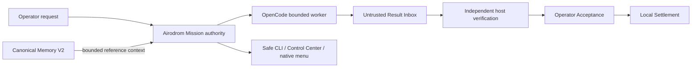
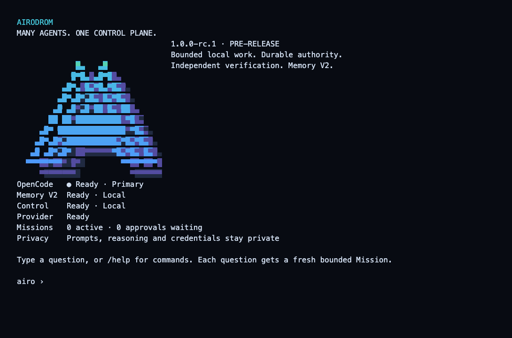
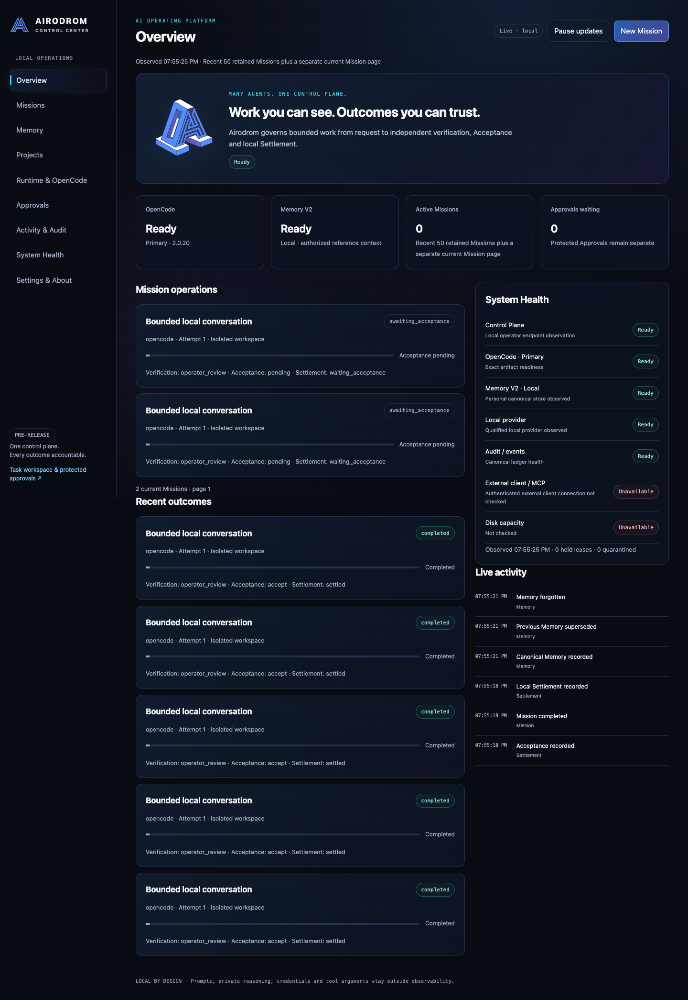

# Airodrom

<p align="center">
  <picture>
    <source media="(prefers-color-scheme: dark)" srcset="public/brand/airodrom-logo-horizontal-dark.svg">
    
  </picture>
</p>

**AI operating platform · PRE-RELEASE · 1.0.0-rc.1**

Airodrom turns bounded local work into accountable Missions. OpenCode executes; Airodrom owns authority, Memory V2, Capability Broker, independent verification, Acceptance, Settlement, leases and audit. The dimensional terminal, live Control Center and native macOS menu expose safe real state throughout that lifecycle.

No supported production release has been published. This source candidate is for development, architecture review and isolated qualification. Package publication and production activation require separate owner decisions.

## Local quickstart

On the qualified macOS platform, use Node 22.23.3 or later in the 22.x line, Xcode command-line tools, qualified OpenCode 2.0.25 and local Ollama with qwen3-coder:30b. Read [installation](docs/INSTALLATION.md) before startup.

```sh
npm ci --ignore-scripts
npm run install:local
airodrom
```

`airodrom help`, `airodrom doctor`, `airodrom open` and `airodrom menu` provide command guidance, safe diagnostics, live operations and the native menu. No-argument startup runs real bounded qualification before saving private pins. Each question gets fresh local authority; scoped coding requires a declared Mission. See [Product Experience V2](docs/PRODUCT-EXPERIENCE-V2.md).



## Product surfaces





These images come from actual local output with synthetic data. The [observed Mission lifecycle](docs/images/mission-lifecycle-v2.png) shows independent verification, operator Acceptance and local Settlement separately.

## Runtime support

| Runtime | Tier | Candidate boundary |
| --- | --- | --- |
| Airodrom host primitives | REQUIRED CONTROL PLANE | Typed broker operations and independent host verification; never a model runtime |
| OpenCode | SUPPORTED / DEFAULT PRIMARY | CLI 2.0.25, macOS and local Ollama; isolated live synthetic Mission and Memory V2 qualification; bounded default route |
| Claude Code | SUPPORTED / OPTIONAL FALLBACK | Adapter contract; operator authentication and runtime qualification required |
| Work/Codex | OPTIONAL EXTERNAL / OPT-IN LIVE QUALIFICATION | Confined Codex 0.160.1 public proposals; host verification/Acceptance; ChatGPT connector exposure separate |
| Cursor | EXPERIMENTAL | Observation only; governed execution denied |
| Generic Cloud | UNSUPPORTED | No dispatch or context transfer |

Agents perform work; reasoning providers supply inference. Model selection and agent text cannot change execution policy. DeepSeek remains disabled/auth_required. See the [runtime matrix](docs/RUNTIME-SUPPORT-MATRIX.md) and [Pi removal migration](docs/PI-REMOVAL.md).

## Source review and development validation

Use a compatible Node **22.23.3 or later in the 22.x line**, with SQLite and FTS5, and npm 10.9.9. The audited host is macOS arm64; other operating systems are unqualified. Extract the source archive into an empty private directory, verify its checksum and file manifest, then run:

```sh
npm ci --ignore-scripts
node scripts/macos/build-slack-keychain-helper.cjs
npm run verify
npm test
npm run typecheck:authority
npm run typecheck:sdk
node scripts/airodrom.cjs --help
```

The source regression suite needs Xcode and a local Git checkout with an initial commit. For an archive, prepare a disposable validation checkout as described in [development](docs/DEVELOPMENT.md). The helper build only compiles local code; it does not read credentials or install a service. These commands validate source and disposable fixtures. Host sandbox qualification tests requiring private operator pins are explicitly skipped when absent. Synthetic transport fixtures require no installed agent. They do not qualify a live provider or grant execution authority.

Interactive startup qualifies installed OpenCode and generates private host pins. Optional host operations require separately reviewed exact pins. See [installation](docs/INSTALLATION.md) before running `npm start`. Service installation is opt-in. Keep credentials out of command arguments, patches, issue reports and repository files.

## Privacy and operation

PersonalMemory is explicit, scoped and local; Project Memory V2 checkpoints are task-scoped. Candidate promotion requires host review. Erasure removes covered application payloads and reconstructive commitments, migrates legacy identities to random UUIDs and blocks stale replay. Restores require independent current erasure and identity authority before any recovered data becomes readable.

Logical erasure does not prove physical deletion from WAL/free pages, SSD, swap, old media, unmanaged exports or already delivered provider copies. Unknown legacy origins remain unavailable. Review [Memory V2](docs/MEMORY-V2.md), [privacy and erasure](docs/PRIVACY-ERASURE.md), [threat model](docs/THREAT-PRIVACY-SUMMARY.md) and [known limitations](docs/KNOWN-LIMITATIONS.md) before storing personal data.

## Documentation and contribution

Start with the [architecture](docs/ARCHITECTURE.md), [development guide](docs/DEVELOPMENT.md), [troubleshooting](docs/TROUBLESHOOTING.md), [security policy](SECURITY.md), [contributing guide](CONTRIBUTING.md) and [release policy](docs/RELEASE-POLICY.md). See [candidate notes](docs/RELEASE-NOTES.md) and [publication gate](PUBLICATION-GATE.md).

The project uses the existing [MIT license](LICENSE). [Third-party notices](THIRD_PARTY_NOTICES.md) cover locked dependencies. Ownership and publication approval remain with the repository owner.
